# System Architecture &amp; Design

**Intelligent Employee Productivity Tracking System (PTA)**

This document describes the end‑to‑end architecture of the system: how raw
behavioural signals are captured on each machine, how they are transformed into
machine‑learning features, and how those features are turned into productivity,
cheat‑detection, and growth predictions served through an API.

> Scope: this is a design and architecture reference. It describes *what the
> system is and how the pieces fit together*. Model training and the live
> dashboard are covered only at the interface level.

> The diagrams below are rendered images stored in [`/diagrams`](../diagrams). Their editable Mermaid source is kept in [`docs/architecture-diagrams.md`](architecture-diagrams.md).

---

## 1. Overview

PTA is a four‑stage pipeline:

1. **Capture** — lightweight agents run on each monitored Windows machine and
   record low‑level behavioural signals (processes, keyboard, mouse, window
   focus).
2. **Store** — every signal is written to a central PostgreSQL database as
   *raw* event tables, one family per input domain.
3. **Aggregate** — server‑side SQL functions roll the raw events up into three
   *feature* tables on fixed time windows, keyed by a canonical per‑device
   identity.
4. **Predict &amp; serve** — three ML models consume the feature tables and write
   predictions, which a stateless HTTP API exposes to the dashboard.

*Figure 1 — End-to-end pipeline: capture → store → aggregate → predict &amp; serve.*

All database traffic passes through a connection pooler, and the API layer is
stateless so it can be scaled horizontally (see §8).

---

## 2. Data capture layer

Each machine runs a set of independent agents, all started together by a single
supervisor process, **`pta_launcher`**. The launcher spawns each service,
streams its console output, and restarts it on failure. Adding the launcher to
the OS auto‑start makes the whole capture stack come up automatically at logon.

The system is deliberately split into one service per input domain. Each service
owns its own tables and can be developed, deployed, and reasoned about
independently.

| Service | Captures | Capture mechanism | Tables written |
|---|---|---|---|
| **Process monitor** | Running processes, lifecycle, resources, security, dependencies | Windows **ETW** (Event Tracing for Windows) via `ferrisetw`, plus native APIs (`NtQuerySystemInformation`, `GetProcessIoCounters`, `WinVerifyTrust`); ~100 ms scan interval | `process_events` (+ `process_lifecycle`, `process_resource_history`, `process_performance_metrics`, `process_session_integration`, `process_security_permissions`, `process_application_classification`, `process_dependencies`; `process_hierarchy` is a view) |
| **Keyboard service** | Keystroke timing, modifiers, shortcuts | Low‑level keyboard hook (`SetWindowsHookEx` / `WH_KEYBOARD_LL`) | `key_events`, `key_modifier_events`, `key_shortcut_events`, `key_special_events` |
| **Mouse service** | Movement, clicks, scroll, drag, gestures | A **capture agent** (`rdev`) posts events over local HTTP to a **backend** (Axum, `127.0.0.1:8000`) which writes to the DB | `mouse_events` (+ `mouse_movement_events`, `mouse_click_events`, `mouse_scroll_events`, `mouse_drag_events`, `mouse_gesture_events`) |
| **Focus service** | Active window / application focus | Foreground‑window polling via the active‑window API (`active_win`) | `focus_events` |
| **Activities syncer** | Derived, enriched activity records | **Does not capture directly** — see §2.1 | `activities` |

> **Privacy note:** the keyboard service records keystroke *dynamics* (timing,
> counts, modifier/shortcut categories) for behavioural features — it is not a
> content keylogger.

### 2.1 Activities are derived, not captured

The **activities service is different from the others**: it does not read any
hardware. It runs a **syncer** that reads `process_events`, enriches each event
by joining the latest related process/session/focus rows, classifies it (e.g.
`web_browsing`, `development`, `communication`, `system`), and writes one
`activities` row per source event.

The syncer is **device‑scoped**: each machine's syncer only processes its *own*
machine's `process_events` (matched on host name). This guarantees that:

- two machines never process the same events (no duplicate activities), and
- one machine going offline never stalls activity derivation for the others.

*Figure 2 — Activities are derived from this host’s process events (per-machine).*

---

## 3. Data model

The database is organised into clear layers. Data only ever flows *downward*:
raw → features → predictions. The raw layer is treated as an append‑only source
of truth; everything below it is derived and can be rebuilt.

*Figure 3 — Data model layers: raw → features → predictions.*

| Layer | Tables | Role |
|---|---|---|
| **Raw** | 20 event tables (see §2) | Source of truth; one family per capture domain |
| **Identity** | `employee_identity`, `employee_identity_override` | Maps each device to a canonical employee (see §4) |
| **Feature** | `unified_time_series`, `cheat_detection_features`, `employee_growth_features` | ML‑ready engineered features (see §5) |
| **Watermark** | `uts_watermark`, `cheat_detection_watermark`, `employee_growth_watermark` | Track how far each aggregator has processed |
| **Prediction** | `productivity_predictions`, `cheat_predictions`, `cheat_alerts`, `growth_predictions` | Model outputs served by the API (see §6) |
| **Staging** | `stg_*` (internal) | Small per‑device scratch tables used inside the aggregators |

The three feature tables are wide by design — roughly **211**, **321**, and
**214** columns respectively — because they encode a large, explicit feature
catalogue rather than opaque embeddings.

---

## 4. Canonical identity layer

A single employee may use more than one machine, and two *different* people may
share the same operating‑system username. Raw events therefore cannot be keyed
directly on the OS username. The identity layer resolves this.

**Principle: identity is device‑centric — one machine = one employee.**

- `employee_identity` maps each `device_id` to a `canonical_user_id`, resolved
  from observed keyboard/mouse activity per device.
- When one username appears on multiple devices, the id is **device‑qualified**
  (e.g. `alice@laptop-1`, `alice@laptop-2`) so two people can never be merged.
- `employee_identity_override` is a manual mapping that always wins, used to
  assign real names.
- A scheduled refresh keeps the mapping current, so a new machine is picked up
  automatically.

Feature aggregators read identity from this layer, so every downstream feature
and prediction is labelled with a stable canonical identity rather than a raw,
ambiguous username.

---

## 5. Feature aggregation layer

Three server‑side SQL functions transform raw events into the three feature
tables. Each runs **incrementally** (driven by its watermark) and produces
**one row per (time window × device)** — never blending multiple machines into a
single row.

| Feature table | Function | Window | Purpose |
|---|---|---|---|
| `unified_time_series` (UTS) | `populate_unified_time_series` | **1 minute** | General per‑minute behavioural profile across all input domains |
| `cheat_detection_features` (CDF) | `populate_cheat_detection_features` | **5 seconds** | Fine‑grained signals for anomaly / cheat detection |
| `employee_growth_features` (EGF) | `populate_employee_growth_features` | **1 day** | Daily skill/growth signals and trends |

Key design points:

- **Watermark‑incremental.** Each function processes only the window range since
  its last run, then advances its watermark. This keeps aggregation cheap as the
  raw tables grow.
- **Per‑device partitioning.** Every window is aggregated separately per device,
  keyed by the canonical identity, so features for different employees are never
  mixed.
- **Staging tables.** For each device, the relevant slice of each raw table is
  materialised into a small `stg_*` table first, so the heavy aggregation reads
  tiny inputs instead of repeatedly scanning the full raw tables.
- **Idempotent.** Re‑running a window replaces (not duplicates) its output, so
  any range can safely be recomputed.

*Figure 4 — Incremental, per-device feature aggregation via staging tables.*

---

## 6. Machine‑learning layer

Three models consume the feature tables. Each is designed around the natural
time granularity of its feature table.

| Model | Full name | Feature source | Granularity | Core approach |
|---|---|---|---|---|
| **PSM** | Productivity Scoring Model | `unified_time_series` | per 1‑min window | Transformer encoder over the time series (positional encoding + attention pooling), with a role/intent adjustment head |
| **CDM** | Cheat Detection Model | `cheat_detection_features` | per 5‑sec window | Transformer‑based reconstruction anomaly detector (`TranAD`) + contrastive representation + a supervised classifier head |
| **GPRM** | Growth Prediction &amp; Recommendation Model | `employee_growth_features` | per day | Dilated **TCN** blocks + an **N‑HiTS** forecasting head, plus a recommendation stage |

The models are trained offline (Python / PyTorch) and exported to **ONNX** so
that inference can run *in‑process* inside the API — no separate model server,
and no network hop on the prediction path.

Model outputs are written to the prediction tables:

- `productivity_predictions` — score, level, role alignment, per‑category
  breakdown.
- `cheat_predictions` + `cheat_alerts` — risk score, dominant vector, evidence;
  alerts only when a threshold is crossed.
- `growth_predictions` — growth score, trajectory, forecasts, strengths /
  weaknesses, ranked recommendations.

---

## 7. Serving layer (API)

A stateless HTTP API (**Axum**, Rust) serves reads from the prediction and
feature tables. Because predictions are precomputed and stored, read latency is
low and independent of model complexity.

| Endpoint | Purpose |
|---|---|
| `GET /health` | Liveness check |
| `GET /api/v1/dashboard` | Fleet‑level summary |
| `GET /api/v1/employees` | Employee list |
| `GET /api/v1/employees/:id/stats` | Per‑employee aggregate stats |
| `GET /api/v1/employees/:id/timeline` | Per‑employee activity timeline |
| `GET /api/v1/inference/:id/productivity` | Latest productivity prediction (PSM) |
| `GET /api/v1/inference/:id/cheat-detection` | Latest cheat risk (CDM) |
| `GET /api/v1/inference/:id/growth` | Latest growth prediction (GPRM) |

All endpoints are keyed by the **canonical** identity, consistent with the
feature and prediction layers.

---

## 8. Infrastructure &amp; scalability

The system is designed to scale from a handful of machines to a large fleet
without changing the application code.

*Figure 5 — Horizontal-scaling architecture (items marked * are design targets).*

Design elements:

- **Connection pooler (PgBouncer, transaction mode).** Each machine runs 5
  services that write frequently. Without pooling, `machines × services` would
  exhaust database connections; the pooler multiplexes thousands of client
  connections onto a small number of real ones.
- **Prepared statements.** Services use named prepared statements sized to the
  pooler so transaction pooling and statement caching coexist correctly.
- **Read/write separation (design target).** Heavy dashboard reads are intended
  to be served from a streaming **read replica** so they never slow the
  write‑path primary. *(Items marked `*` are part of the horizontal‑scaling
  design; a small deployment can run a single node.)*
- **Stateless API tier behind a load balancer (design target).** API instances
  hold no session state, so they scale horizontally.
- **In‑process ONNX inference.** Models run inside the API process, avoiding a
  separate inference service and its latency.
- **Automated disk safety.** A scheduled guard watches disk usage; on pressure
  it first trims logs, and only if that is insufficient does it archive the
  oldest *already‑aggregated* raw data off‑node and prune it — never touching the
  engineered feature tables, and never deleting raw a feature aggregator has not
  yet consumed.

### Repository layout

| Path | Contents |
|---|---|
| `process-monitoring-service/` | Process/ETW capture agent |
| `keys_input-monitoring-service/` | Keyboard capture service |
| `mouse_input-monitoring-service/` | Mouse capture agent + backend |
| `focus-monitoring-service/` | Window‑focus capture service |
| `activities-monitoring-service/` | Activity derivation syncer |
| `pta-launcher/` | Supervisor that starts all agents on a machine |
| `pta-backend-api/` | Axum HTTP API + SQL for identity/prediction tables |
| `pta-ml/` | Python ML package (PSM / CDM / GPRM, training, ONNX export) |
| `foundation-stubs/` | Shared internal crates |
| `docs/` | Architecture and design documentation |

---

## 9. Design principles

- **One service per domain.** Independent capture agents that own their tables —
  simpler to build, deploy, and reason about; a failure in one does not stop the
  others.
- **Raw is the source of truth; everything else is derived.** Features and
  predictions can always be rebuilt from raw events, which makes aggregation
  changes safe and reversible.
- **Device‑centric identity.** Because a person can have several machines and
  usernames can collide, identity is resolved per device and never merges two
  people.
- **Incremental, idempotent aggregation.** Watermark‑driven functions keep the
  cost bounded as data grows, and any window can be safely recomputed.
- **Precompute predictions; serve them cheaply.** Models run offline / in the
  scoring path and store results, so the API stays fast and stateless.
- **Safety by construction.** The disk guard, per‑device partitioning, and
  idempotent aggregation are designed so routine operations cannot corrupt or
  lose the engineered data ML depends on.

---

*This document reflects the system design as implemented in this repository.
Component‑level detail (individual feature definitions, model training
procedures, and the dashboard) is covered in separate documents.*
