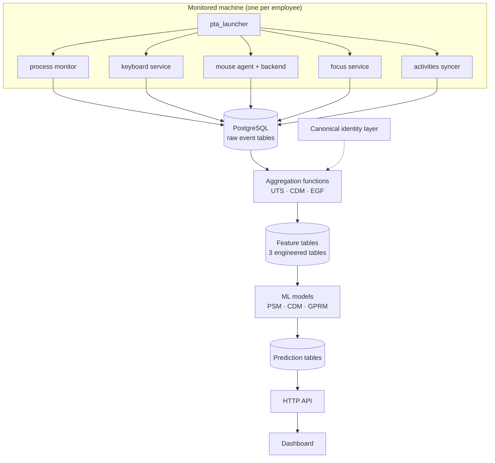
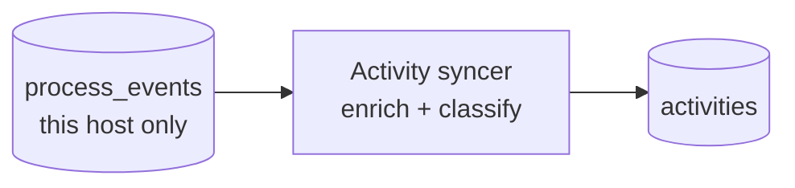
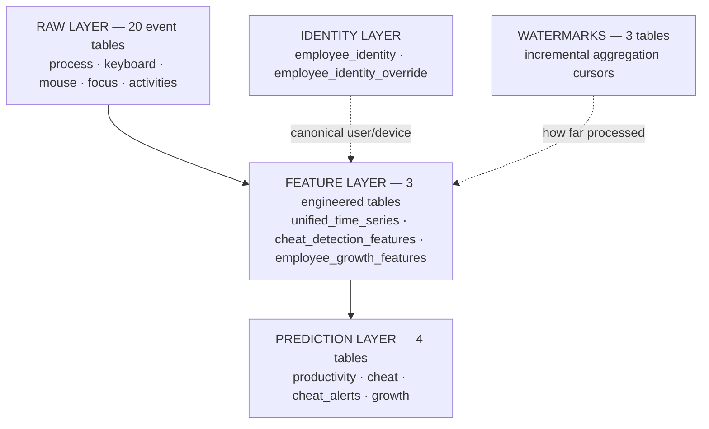
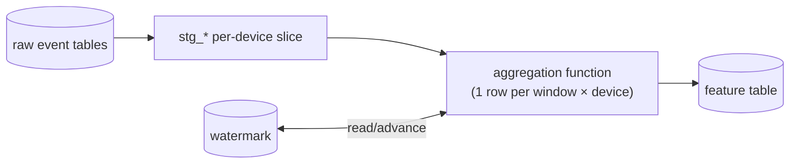
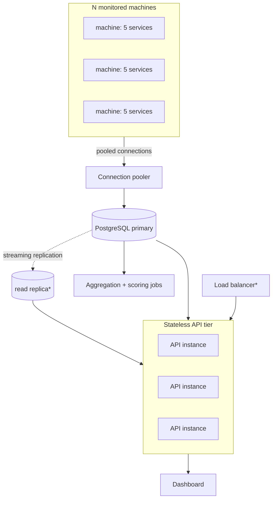

# Architecture diagram sources (Mermaid)

Editable source for the rendered diagrams in `SYSTEM_ARCHITECTURE.md`. Re-export to `/diagrams/<name>.svg` after editing.

## High-level pipeline (Figure 1)

`diagrams/01-high-level-pipeline.svg`

## Activity derivation (Figure 2)

`diagrams/02-activity-derivation.svg`

## Data model layers (Figure 3)

`diagrams/03-data-model-layers.svg`

## Feature aggregation (Figure 4)

`diagrams/04-feature-aggregation.svg`

## Infrastructure &amp; scaling (Figure 5)

`diagrams/05-infrastructure-scaling.svg`

